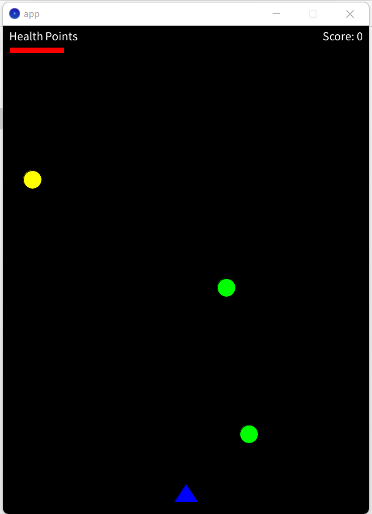

# Asteroid Game
## Overview
Asteroid Game is a simple 2D space shooting game where the player controls a spaceship to shoot and destroy asteroids. The game includes different types of asteroids (green, yellow, and red), each with unique health, points, and damage values. Players can control the spaceship using keyboard inputs and progress through various difficulty levels.

## Preview
<p align="center">
  
  
  
  
  
</p>

## Features
#### Asteroid Types:
- Green Asteroid: Health: 1, Points: 10, Damage: 5
- Yellow Asteroid: Health: 2, Points: 20, Damage: 15
- Red Asteroid: Health: 4, Points: 50, Damage: 25
#### Control Instructions:
- A: Move Left
- D: Move Right
- Space: Shoot
#### Game Modes:
- Levels: Easy, Medium, and Hard (adjusts asteroid spawn rates)
- Dynamic Difficulty: Asteroid spawn rates adjust based on the selected level
#### Game States:
- Intro Screen: Displays asteroid types and control instructions
- Menu Screen: Select difficulty level (Easy, Medium, Hard)
- Gameplay Screen: Control spaceship, shoot asteroids, and score points
- Game Over Screen: Display score and options to restart or go to the menu
- Restart Mechanism: Ability to restart after game over
## Installation
Clone this repository to your local machine:

  ```sh
  git clone https://github.com/TheVinh-Ha-1710/2D-Asteroids-Shooting-Game.git
  ```

Ensure you have Processing IDE installed

Open the project in Processing IDE and run the *app.pde* file.
